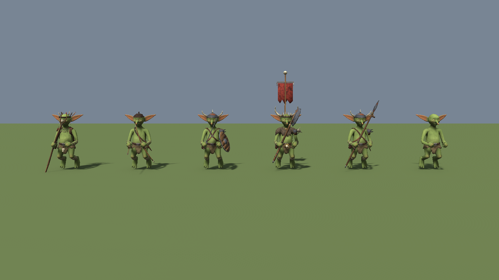
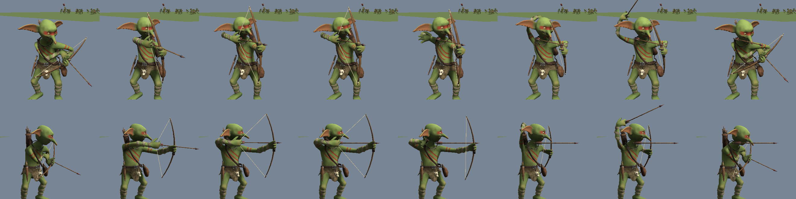
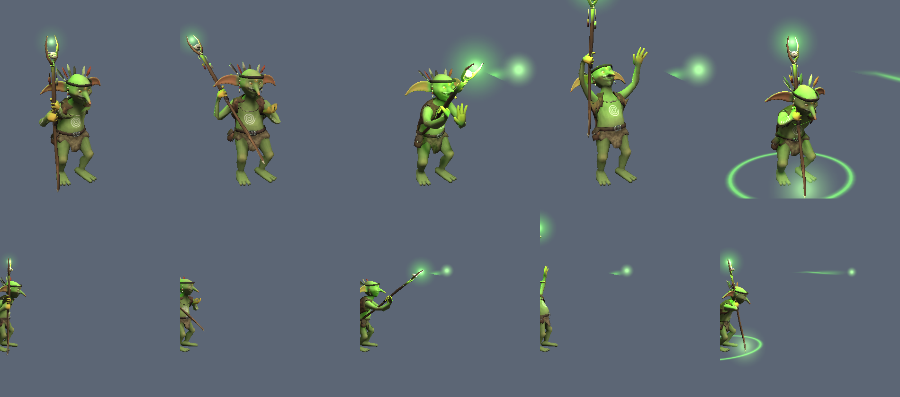

# Goblins

Generic goblin for the colony sim: procedural body, Unity-Humanoid rig in T-pose, hand-painted baked
textures, and modular gear. Props are separate objects on socket bones, not part of the body mesh, so every
goblin that shares this skeleton can carry any prop.



Blender file: `blender/goblins.blend`, scene **Goblin** (plus **Goblin_Archer** and **Goblin_Shaman** for the custom
clips, and **Goblin_Props**, a catalog). Everything in it is rebuilt from `src/`.

## Rebuild

In Blender (Python console or the MCP):

```python
import sys; sys.path.insert(0, r"E:\Unity\Projects\GameArtGeneration\Goblins\src")
import gob_build, gob_export
gob_build.build_all()      # body -> rig -> weights -> skin texture -> gear -> gear atlas (~25 s)
gob_export.export_all()    # export/Goblin.fbx, export/Props/*.fbx (the bakes are in textures/)

import gob_anim            # custom clips (the bow), authored on the rig
gob_anim.build_clips()     # actions Bow_Ready, Bow_Shoot, Bow_Volley
gob_anim.build_shaman_clips()   # Shaman_Idle, Shaman_Hex, Shaman_Chant
gob_anim.export_clips()    # export/Anims/Goblin@<clip>.fbx
gob_anim.clear()           # back to the T-pose before exporting the character again
```

| Script | Does |
|---|---|
| `gob_body.py` | Lofted limbs/torso, sculpted head (brow, sockets, grin, chin), cupped ears, nose, hands, feet; voxel-fused, symmetrised, decimated (head gets a larger share) |
| `gob_rig.py` | Armature (Unity Humanoid names), sockets, IK helpers, heat-map weights + smoothing, 4 influences max |
| `gob_paint.py` | Skin colours, AO and curvature painted on the dense mesh, baked to the game mesh; the mouth is painted per texel |
| `gob_gear.py` | Skinned outfits, socket props, painted source materials, one gear atlas |
| `gob_export.py` | FBX for Unity |
| `gob_anim.py` | Custom clips keyframed through the rig's IK and baked on export (the archer's and the shaman's) |

## Budget (colony camera, ~40 m at 50°, no LODs)

| Part | Triangles |
|---|---|
| GoblinBody (incl. eyes) | 3,634 |
| Outfit_Loincloth / Harness / Wraps | 636 / 928 / 960 |
| Weapons: Spear, Glaive, Sword, Cleaver, Axe, Club | 456, 416, 400, 244, 336, 266 |
| Shields: round, plank | 676, 240 |
| Head: Helmet, PotHelm, LeatherCap, Hair | 762, 256, 458, 256 |
| Pauldron, Pouch, Knife, Waterskin, Sack, Necklace, SkullTrophy | 236, 202, 240, 198, 504, 368, 264 |
| Archer: Shortbow, Arrow, Quiver | 270, 134, 542 |
| Shaman: Staff, Headdress, Outfit_ShamanCloak | 732, 860, 1,080 |
| **A heavily kitted goblin** | **~9,000** |

Textures:
- `T_Goblin_Skin`, `T_Goblin_Skin_Warpaint`, `T_Goblin_Skin_Chief` and `T_Goblin_Skin_Shaman`, 1024².
- `T_Goblin_Gear`, 2048²; it holds all 29 props and the outfits.

UVs are laid out on purpose, not by Blender's automatic projection:
- **Body** (`gob_paint.unwrap`): cut along natural seams (down the back of trunk and head, under the arms, inside
  the legs, around hands, fingers, feet, ears and eyes), unfolded angle-based, one texel density, the face and eyes
  enlarged.
- **Gear:** every building block in `gob_common` / `gob_gear` (tubes, rings, straps, slabs, boxes, capes) writes its
  own UVs as it is built. `bake_gear` only evens out the density and packs.
- **Gutters:** after each bake, the empty space between pieces is filled with the nearest piece's colour
  (`fill_gutters`), so mip-maps at colony distance never pull black into the edges.

Two materials per goblin (skin and gear). Segment counts for the gear are scaled in one place (`SEG_SCALE` in
`gob_gear.py`); the body budget is `build_all(body_tris=...)`.

Blender: the **Goblin_Props** scene is a catalog of every prop (`gob_catalog.build_catalog()`). The Goblin scene
shows the spearman loadout; the other props are hidden there.

Body shape keys (Unity blend shapes):
- `Fat` and `Skinny`: belly, limbs, neck. The outfits carry matching keys (`gob_shapes.py`).
- `EarsDroop`, `EarTornL`, `EarTornR`.

## Skeleton

Hips, Spine, Chest, UpperChest, Neck, Head, Jaw (unweighted), Left/RightEye, Left/RightEar01-02 (ear flop),
Left/Right Shoulder, UpperArm, LowerArm, Hand, Thumb/Index/Middle/Ring x3, UpperLeg, LowerLeg, Foot, Toes,
under a `Root`. 52 deform bones. `IK_*` and `Pole_*` bones (legs IK on, arms IK off) are for animating in
Blender and are left out of the FBX.

## Sockets (props are modelled in socket space: origin = attach point)

| Socket | Parent | Axes | For |
|---|---|---|---|
| Socket_RightHand / LeftHand | Hand | +Y along the handle toward the business end, +Z up in T-pose (same frame both hands) | weapons, tools, instruments |
| Socket_LeftForearm / RightForearm | LowerArm | +Y along the arm, +Z away from the forearm | shields, bucklers |
| Socket_LeftShoulder / RightShoulder | UpperArm | +Y along the arm, +Z up | pauldrons |
| Socket_LeftHip / RightHip | Hips | +Y up, +Z outward (70° from the front, clear of hanging arms) | pouches, knives, bells, bomb pouches |
| Socket_Belt | Hips | +Y up, +Z forward | buckle, trophies |
| Socket_Chest | UpperChest | +Y up, +Z forward | chest plate, amulet |
| Socket_Back | UpperChest | +Y up, +Z backward | backpack, quiver, bomb sack, banner |
| Socket_Helm | Head | +Y up, +Z forward, at the head centre | helmets, hats, crowns |

Unity sees the same axes (checked in the verify project).

## Unity

Install into a Unity 6 URP project (MedievalSetting has it) with:

```
powershell -ExecutionPolicy Bypass -File tools\install_to_unity.ps1 -Project E:\Unity\Projects\MedievalSetting
```

It copies scripts, models, clips and textures under `Assets/Goblins` and keeps existing `.meta` files. Then run
**Tools > Goblins > Rebuild Prefabs and Showcase**; it runs by itself the first time. A report and verification
renders go to `Logs/GoblinSetup`. The animation test scene expects the Kevin Iglesias *Human Animations* pack from
the Asset Store in the same project; it is not part of this repo.

| `Assets/Goblins/...` | Contents |
|---|---|
| `Models/` | `Goblin.fbx` (rig + body + outfits, Humanoid), `Props/Prop_*.fbx`, `Anims/Goblin@<clip>.fbx` (bow and shaman clips) |
| `Textures/`, `Materials/` | skins (1024²), gear atlas (2048²), `M_Goblin_Skin*`, `M_Goblin_Gear`, `M_Goblin_BowString`, `M_Goblin_Magic` |
| `Prefabs/Goblin_Base` | plain goblin: body + loincloth, Humanoid Animator, `GoblinAppearance`, no weapon |
| `Prefabs/Goblin_Spearman`, `_Swordsman`, `_Chief`, `_Archer`, `_Shaman` | variants of Goblin_Base (see the sections below) |
| `Prefabs/Props/Prop_*`, `Arrow_Projectile` | one prefab per prop: drop it under the socket it names and Reset its transform |
| `Animation/GoblinAnims_*` | clip pools for the animation test scene |
| `Scenes/` | `Goblins_Showcase` (lineup, close and 40 m colony cameras), `Goblins_AnimationTest` |
| `Scripts/` | runtime: appearance/merge, loadout, posture, two-hand grip, archer, shaman and effects, random animator; editor: `GoblinSetup`, `GoblinModelPostprocessor`, `GoblinAnimationTestBuilder` |

After a new Blender export, run the install script again, then the rebuild. The rebuild replaces the open scene
only if it has no unsaved changes, and reopens it afterwards; otherwise it builds the showcase alongside it.

- `GoblinModelPostprocessor` pins the Jaw slot to the `Jaw` bone. Unity's auto-mapper otherwise gives it to
  the helmet socket or leaves it empty.
- If you re-export with renamed bones over an existing import, delete `Goblin.fbx.meta` first: Unity keeps the
  old mapping and the avatar fails.
- `GoblinLoadout` attaches `Props/*` prefabs to sockets at runtime (identity pose) and hides props already
  nested under the sockets.

Verified:
- In the scratch `unity_verify` project (batch mode): valid Humanoid avatar, 49 bones mapped, Jaw -> Jaw, and
  standalone props land 0.000 mm from the embedded reference (`gob_export.export_all(embed_props=True)`).
- In MedievalSetting (URP): a relaxed Humanoid muscle pose deforms both prefabs and carries the props.

### Variation and performance

`GoblinAppearance` (on Goblin_Base, so on every goblin) rolls a look in `Awake`. `Reroll()` rolls a new one at
runtime.

**Slots.** Each slot picks one weighted option (a prop prefab or nothing) and puts it on the first free socket from
its list. That replaces the props the prefab shows in the editor. Weights are relative within a slot:

| Slot | Options | Socket |
|---|---|---|
| Spearman weapon | Spear 1.2, Glaive 1 | right hand |
| Swordsman weapon | Sword, Cleaver, Axe, Club (1 each) | right hand |
| Swordsman shield | round 1.4, plank 1 | left forearm |
| Head, armed | Helmet 3, LeatherCap 2, PotHelm 1.5, Hair 1.5, none 2 | head |
| Head, unarmed | Hair 3, LeatherCap 1.5, PotHelm 0.7, none 4 | head |
| Shoulder | Pauldron 1, none 1 | either shoulder |
| Hip gear | Pouch 2, Waterskin 1.5, none 2 | either hip |
| Hip blade | Knife 1.5, none 2.5 | either hip |
| Back | Sack, none | back |
| Chest | Necklace, none | chest |
| Belt | SkullTrophy, none | belt |

The unarmed goblin's other slots differ slightly (Sack 2 : none 3, Knife 1 : none 3, SkullTrophy 0.5 : none 4).

**Outfits.** Harness and wraps switch on by chance: armed 75% / 60%, unarmed 25% / 35%.

**Shapes.** Blend shapes, at most one per group:
- Build: Fat 30% or Skinny 35%.
- EarsDroop 25%, EarTornL 12%, EarTornR 12%.
- Hip, belt, chest and back gear moves out on a fat body and in on a skinny one ("pushes").

**Skin and size.** A skin from the list (normal ×2, Dark, Olive, Grey, Warpaint, WarpaintDark) and a size of
0.92–1.08.

Set `seed` for a fixed look. The tables are in `GoblinSetup.cs`, or edit them per prefab in the Inspector.

After rolling, it **merges** every visible part into one SkinnedMeshRenderer, with one submesh per material
(skin and gear) and the chosen blend shapes baked in. Goblins that end up looking the same share one merged mesh. Props are skinned rigidly to their
own transform, so `GoblinTwoHandGrip` still moves the spear.

Measured on 16 goblins in the test scene (URP, same frame):

| | Separate parts | Merged |
|---|---|---|
| Goblin renderers | 94 | 16 |
| Skinned meshes updated | 53 | 16 |
| Draw calls, whole frame (incl. shadows) | 558 | 227 |
| Shadow casters | 310 | 102 |

So variation costs nothing at runtime; the separate parts did. Keep the modular source for authoring and merge
at spawn. Next steps if crowds get large:
- One combined skin+gear atlas, so each goblin is one draw instead of two.
- Animator "Optimize Game Objects", exposing only the sockets.
- Fewer finger bones.

Gotcha: the Animator culls by the renderers it saw when it bound. After swapping renderers, call `Animator.Rebind()`
(`SetMerged` does), or `CullUpdateTransforms` treats the goblin as off-screen and it freezes in T-pose.

### The chief

`Goblin_Chief` is a variant of Goblin_Base: same skeleton, body, sockets and animation setup. What changes:
- **Size and shape:** 1.25–1.3× scale. Always `Brawny` (bigger shoulders, arms, chest, neck and hands), 60%
  also `Fat`, and often a torn ear.
- **Outfit:** fur mantle (`Outfit_FurMantle`: pelt over the shoulders with a short cape and a brass clasp), no harness.
- **Head and gear:**
  - `Prop_BoneCrown`: headband, a fan of bone spikes, two great horns.
  - `Prop_GreatAxe`: two-handed.
  - `Prop_SkullPauldron` on the left shoulder, 80%.
  - `Prop_ChiefBuckle` on the belt.
  - `Prop_WarBanner` on the back, 75%: a pole rising far above him with a red flag and a skull. It is what makes him
    findable from the 40 m colony camera.
- **Skin:** `T_Goblin_Skin_Chief`, pale bone-ash paint: skull mask with dark eye rings, jaw stripes, chest bands.
- **Animation:** `GoblinAnims_Chief`, two-handed combat (2H idle, cleaves, parry; the grip keeps both fists on the
  haft) plus commanding gestures and roars.

Brawny also pushes shoulder, forearm, chest, back and hip gear outward, so it rides on top of the extra bulk.

### The archer

`Goblin_Archer` is a variant of Goblin_Base with a short bow in the left hand, an arrow in the right and a quiver
over the right shoulder (its strap replaces the harness). Archers are the scrawny ones: often `Skinny`, 0.88–1.0×.

The Kevin Iglesias pack has no bow clips, so these are made in Blender (`gob_anim.py`, scene **Goblin_Archer**,
which shows the archer and a preview string; scrub the timeline to watch):

| Clip | Length | What happens |
|---|---|---|
| `Bow_Ready` | 2.0 s, loop | low ready: half side-on, bow upright in front of the left hip, elbows soft, draw hand on the nock, arrow at the ground ahead, breathing |
| `Bow_Shoot` | 2.8 s | raise, draw to the jaw, aim, loose (1.10 s), follow through, fresh arrow from the quiver over the right shoulder (in hand 2.07 s), swung out past the shoulder, nock (2.40 s), back to ready |
| `Bow_Volley` | 2.87 s | the same drawn 35° up; loose at 1.17 s |

The target is the goblin's forward. The clips play in place (root baked into the pose), and all three share the
same foot stance, so they chain without sliding.

The poses come from aim geometry rather than hand-set angles. The arrow runs from the draw hand at the jaw,
through the arrow rest on the bow, along the aim line, and the bow arm's reach sets the draw length (0.43 m).

To change them, edit the key poses in `gob_anim.py` (`pose_ready`, `pose_aim`, `pose_quiver`, `_shoot_keys`),
then run `build_clips()` and `export_clips()`. After that, copy `export/Anims` to `Assets/Goblins/Models/Anims`
and run **Tools > Goblins > Rebuild Prefabs and Showcase**. The rebuild imports the clips as Humanoid with
Goblin.fbx's avatar.

`GoblinArcher` (runtime) does the parts a skeleton can't:
- **String:** a three-point line between the bow tips. While an arrow is nocked, its middle rides in the drawing
  fingers.
- **Arrow:** laid from the fingers through the arrow rest, so it stays true after retargeting. Hidden after the
  loose, back in the hand when it comes out of the quiver.
- **Timing:** read from the playing clip (`timings`, in seconds). It works with `GoblinRandomAnimator`, an
  Animator Controller, or a game's own animation driver that implements `IGoblinAnimSource` (the clip playing, its
  time, the two-hand and hunch weights); `GoblinShaman`, `GoblinPosture` and `GoblinTwoHandGrip` read it the same way.
- **Other clips:** walks, idles and hurts carry the bow with no arrow out.
- **Loose:** the `Loosed` event fires with the nock position and velocity; hook damage and sound there. If
  `projectile` is set it also flies a `GoblinArrow`, which is ballistic, sticks in the ground and is pooled
  (`GoblinArrow.Fire(.., clear)` ignores what it meets within `clear` m across of the nock: the archer's own parapet).
- **Driving it yourself:** call `Apply(clip, seconds, dt)` after sampling a pose.

The bow clips already carry the hunch, so their pools are marked `upright` and `GoblinPosture` fades out for
them.

Performance: the bow, arrow and quiver merge into the goblin's one mesh like any prop. The arrow is hidden by
scaling its transform to zero, which works in the merged mesh too. Extra per archer: the string's LineRenderer
(one draw call), plus each arrow in flight.

### The shaman

`Goblin_Shaman` is a variant of Goblin_Base:
- **Gear:** a gnarled forked staff taller than he is, with a horned skull in the fork and feathers hanging below
  it. A headdress with a fan of feathers and bead strings at the temples. A ragged hide cape
  (`Outfit_ShamanCloak`), open at the chest and down to the hips behind, tied with a cord.
- **Paint:** `T_Goblin_Skin_Shaman`: dots under the eyes and down the chin, an ochre third eye on the brow, a white
  spiral on the chest, dotted forearms, ochre-dipped hands.
- **Look:** old and bony (often `Skinny`, usually `EarsDroop`), 0.9–1.0×.

Clips made in Blender (`gob_anim.py`, scene **Goblin_Shaman**, with a glowing preview ball on the staff):

| Clip | Length | What happens |
|---|---|---|
| `Shaman_Idle` | 3.0 s, loop | hunched, leaning on the planted staff with both hands, muttering |
| `Shaman_Hex` | 2.0 s | staff drawn back past the ear, thrust up at the target with the palm pushed after it: **Hex at 0.73 s** |
| `Shaman_Chant` | 3.2 s | staff lifted overhead, other hand to the sky, head back, then slammed down: **Chant at 1.73 s** |

`GoblinShaman` (runtime) handles the magic:
- **Staff glow:** a glow on the staff head that pulses and swells while a spell gathers. A faint green point light
  goes with it (`orbLight`).
- **Hex, the attack:** a green bolt with a trail flies from the staff head along the goblin's forward. It bursts on
  the first collider or at `boltRange`.
- **Chant, the support spell:** a ring spreads over the ground to `ringRadius`, with a flash where the staff struck.
  Heal or bolster the goblins inside it.
- **`Cast` event:** fires with the spell name, origin and direction. Hook damage, healing and sound there.
- **Timing:** read from the playing clip, like `GoblinArcher`. Call `Apply(clip, seconds, dt)` to drive it
  yourself.

The glow uses `M_Goblin_Magic`, an additive URP Particles/Unlit material with a soft dot texture (`T_Goblin_Glow`),
both made by the setup. The effect objects are named `FX_*`, and `GoblinAppearance` leaves anything named that way
out of the merged mesh. From the colony camera, the green glow is what picks the shaman out of the crowd.

### Animation test scene

`Scenes/Goblins_AnimationTest` (rebuild with **Tools > Goblins > Build Animation Test Scene**): 2 chiefs, 2 shamans,
6 archers, 6 spearmen, 6 swordsmen and 6 unarmed goblins play random clips (Kevin Iglesias Humanoid clips, plus the
custom clips: archers ready, shoot, volley and loose salvos; shamans hex and chant; both also walk, idle and die). Press Play. The panel can re-roll
every goblin's look, and its labels can show each goblin's look instead of the clip.

- `GoblinRandomAnimator` plays clips through a playable graph with crossfades and foot IK. Root-motion walks
  and runs wander and steer back inside 7 m.
- The clip pools are the `Animation/GoblinAnims_*` assets (Polearm, SwordShield, Chief, Archer, Shaman, Unarmed) (weights, sequences such
  as Begin/Loop/Stop, death followed by getting up); edit them in the Inspector.
- `GoblinPosture` adds a goblin hunch on top of any clip.
- Spearmen use the polearm clips, which are two-handed. `GoblinTwoHandGrip` swings the spear about the right fist so the shaft runs through the left fist while a pool marked `twoHanded` plays. Swordsmen use the one-handed sword and shield clips. A shield on a polearm goblin clips through the shaft, so no loadout combines them.
- The on-screen panel has camera presets (colony 40 m / mid / close; right-drag orbits, scroll zooms), a hunch
  toggle, time scale, reshuffle, and clip names over heads.

## Repository

| Path | What |
|---|---|
| `src/` | the Blender Python that builds everything |
| `blender/goblins.blend` | the working file (16 MB) |
| `export/` | Unity-ready FBX: `Goblin.fbx`, `Props/`, `Anims/` |
| `textures/` | baked skins and gear atlas |
| `unity/Goblins/` | the Unity scripts (`Runtime/`, `Editor/`); `unity/Verify/` is the batch-mode export check |
| `tools/install_to_unity.ps1` | copies all of it into a Unity project |
| `docs/images/` | the pictures in this README |
| `HANDOFF.md` | conventions, open issues and checks for whoever picks this up next |

Not in git: `renders/` (review renders, ~80 MB), Blender's `.blend1` backups, and `export/Textures/` (a copy of
`textures/` that `export_all` writes).




## Limits / next

- The mouth is painted and sculpted; there is no mouth interior, so `Jaw` is unweighted.
- Hands have a thumb and three fingers.
- 12 small faces fold over in the crease between thumb and index finger (the voxel remesh pinches the fingers
  together there); they cover under 2 cm² and don't show.
- Still to build: bard, grenadier and warg raider as prop and outfit sets on these sockets (the bard and the
  grenadier's throw will need clips from `gob_anim.py` too), and the warg as its own quadruped rig with a saddle socket.
- The bow clips have one aim height each (level, 35° up). A game that aims at a target should turn the goblin
  toward it. Aiming up or down between the two would take an additive aim clip or a spine offset.
